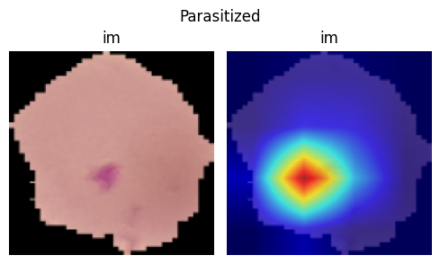

# Malaria Cell Classification with PyTorch & Grad-CAM

This project implements a **Convolutional Neural Network (CNN)** to classify
**malaria-infected vs. uninfected blood cells**, and visualizes model interpretability 
using **Grad-CAM heatmaps**.  
It uses the public Kaggle dataset: *Cell Images for Detecting Malaria*.

---

## Features
- Train a custom CNN to classify **Parasitized** vs **Uninfected** cells  
- Data augmentation with torchvision  
- GPU-accelerated training (Colab-friendly)  
- Grad-CAM visualization to highlight regions used by the CNN   

---

## Installation

```bash
# Clone the repository
git clone https://github.com/faisal-ajao/malaria-gradcam-classification.git
cd malaria-gradcam-classification

# Create a virtual environment (optional)
python -m venv venv
source venv/bin/activate    # Linux/Mac
venv\\Scripts\\activate     # Windows

# Install dependencies
pip install -r requirements.txt
```

---

## Usage

### Run training + Grad-CAM visualization:

```bash
jupyter notebook main.ipynb
```

---

## Output Example (Image)

Example Grad-CAM output for an infected cell:

<p>
  
</p>

---

## Project Structure
```
malaria-gradcam-classification/
├── assets/                    # Grad-CAM heatmaps & sample outputs
│   └── example.png
├── main.ipynb      # Full notebook with training & CAM
├── README.md
├── LICENSE
└── requirements.txt
```

---

## Tech Stack
- Python 3.12  
- PyTorch  
- torchvision  
- scikit-learn  
- OpenCV  
- NumPy  
- Matplotlib  

---

## License
This project is licensed under the MIT License – see the `LICENSE` file for details.
